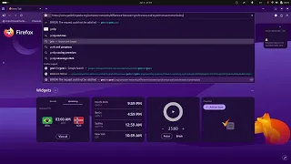
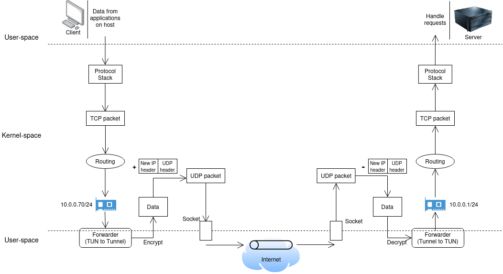
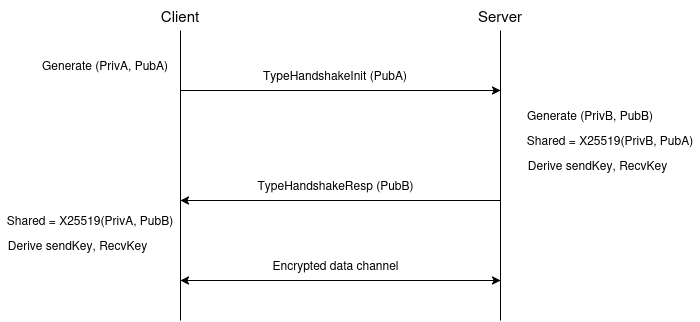
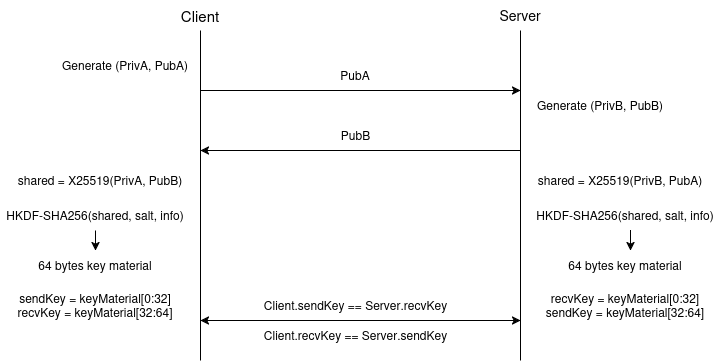
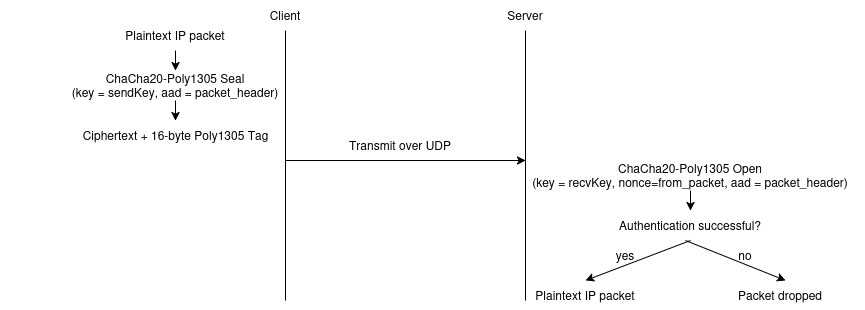

# VPN

A Virtual Private Network implemented in Go. Establishes an encrypted UDP tunnel between a client and a server using ephemeral X25519 key exchange, HKDF-SHA256 key derivation, and ChaCha20-Poly1305 authenticated encryption. The server acts as an Internet gateway; the client routes all traffic through the tunnel.

---

## Demo

[](https://www.youtube.com/watch?v=g-09gffKAK8)

**Ping through the VPN tunnel**
```
$ ping 10.0.0.1
PING 10.0.0.1 (10.0.0.1) 56(84) bytes of data.
64 bytes from 10.0.0.1: icmp_seq=1 ttl=64 time=42.1 ms
...
```

**Public IP changes after connecting**
```
# Before VPN
$ curl -4 ifconfig.me
<your-local-ip>

# After VPN
$ curl -4 ifconfig.me
<vps-public-ip>
```

**Internet access through the VPN**
```
$ curl -4 ifconfig.me   # returns VPS IP while VPN is active
```

---

## Overview

This project demonstrates how a Layer-3 VPN works at the systems level. It covers the full stack from kernel TUN interface to encrypted UDP transport: how raw IP packets are captured, framed, encrypted, forwarded across the Internet, decrypted, and re-injected into the remote kernel.

The implementation intentionally avoids high-level VPN libraries. Each subsystem such as key exchange, session management, packet framing, routing, forwarding is built from primitives to make the internals visible and auditable. It is not intended for production use.

---

## Features

- UDP transport with a custom binary framing protocol
- Ephemeral X25519 key exchange (RFC 7748)
- HKDF-SHA256 session key derivation (RFC 5869)
- ChaCha20-Poly1305 authenticated encryption (RFC 8439)
- Sliding-window replay protection (64-packet window)
- Linux TUN interface for Layer-3 packet capture and injection
- Longest-prefix-match (LPM) routing table
- Concurrent forwarding pipeline with separated control and data planes
- Peer table with session state and idle timeout eviction
- Event bus for decoupled metrics and operational logging
- Internet gateway mode: server performs iptables MASQUERADE; client installs a default route through the tunnel with a host route preserving connectivity to the VPS

---

## Architecture

### Packet flow



### Control plane

The control plane (`internal/server`) handles all peer lifecycle events. It owns the handshake state machine, session key installation, keepalive signaling, and idle timeout eviction. It reads from the UDP socket and dispatches `TypeHandshakeInit`, `TypeHandshakeResp`, `TypeKeepAlive`, and `TypeClose` packets. It never inspects IP packet payloads.

### Data plane

The data plane (`internal/forward`) runs two long-lived goroutines regardless of peer count:

- **TUN to Tunnel**: reads a raw IP packet from the TUN fd, performs a longest-prefix route lookup to select a peer, encrypts with the session's send cipher, and writes the framed datagram to the UDP socket.
- **Tunnel to TUN**: reads a UDP datagram from the socket, decrypts with the session's receive cipher, validates the replay window, and writes the plaintext IP packet to the TUN fd.

The two planes share the `PeerTable` as their only interface. The control plane writes sessions into the table; the data plane reads them out. Neither imports the other.

---

## How It Works

### 1. Handshake

The client sends a `TypeHandshakeInit` packet containing its ephemeral X25519 public key (32 bytes). The server generates its own ephemeral keypair, computes the shared secret, derives session keys, and replies with `TypeHandshakeResp` containing its public key. The client receives the response, computes the same shared secret, and derives matching session keys. Both sides transition to `StateEstablished`.



Handshake packets are transmitted in plaintext. The public keys they carry are ephemeral; the shared secret is never transmitted.

### 2. Session establishment

After the handshake completes, both sides hold a `Session` containing two independent ciphers:

- `sendCipher`: initialized with the local send key
- `recvCipher`: initialized with the remote send key

The initiator's send key equals the responder's receive key and vice versa, enforced by the `isInitiator` flag passed to `DeriveKeys`.

### 3. Packet forwarding

The data plane operates independently of peer count. A single TUN reader goroutine parses the destination IP of each outgoing packet, looks up the peer via the LPM routing table, encrypts, and sends over UDP. A single UDP reader goroutine receives, decrypts, and writes back to TUN.

### 4. Routing

The routing table stores `(network *net.IPNet, peer *Peer, metric int)` entries sorted by prefix length descending. `Lookup(ip)` iterates the sorted slice and returns the first matching peer, longest prefix wins. Tie-breaking uses the metric field (lower is preferred).

When the client connects, it installs two kernel routes:

```bash
# Host route to the VPS — preserves tunnel connectivity
ip route add <VPS_IP>/32 via <physical_gateway>

# Default route through the tunnel
ip route del default
ip route add default via 10.0.0.1 dev tun0
```

### 5. Encryption

Each outgoing data packet is sealed with ChaCha20-Poly1305. The nonce is a 96-bit monotonic counter (big-endian, 8 bytes in the low field). The 7-byte packet header is passed as additional authenticated data (AAD), binding the ciphertext to its header so headers cannot be substituted between packets.

### 6. Internet gateway

The server forwards decrypted client traffic to the Internet using Linux kernel facilities. `ip_forward` allows the kernel to route packets between interfaces. `iptables MASQUERADE` rewrites the source IP of forwarded packets to the server's public IP before they leave `eth0`, and restores destination IPs of returning packets. There is no application-level NAT.

---

## Protocol

### Packet frame

Every UDP datagram begins with a fixed 7-byte header:

```
 0               1               2               3
 0 1 2 3 4 5 6 7 0 1 2 3 4 5 6 7 0 1 2 3 4 5 6 7 0 1 2 3 4 5 6 7
+-+-+-+-+-+-+-+-+-+-+-+-+-+-+-+-+-+-+-+-+-+-+-+-+-+-+-+-+-+-+-+-+
|                     Magic  (0x56504E21)                       |
+-+-+-+-+-+-+-+-+-+-+-+-+-+-+-+-+-+-+-+-+-+-+-+-+-+-+-+-+-+-+-+-+
|     Type      |         Payload Length        |    Payload...
+-+-+-+-+-+-+-+-+-+-+-+-+-+-+-+-+-+-+-+-+-+-+-+-+-+-+-+-+-+-+-+-+

Magic:          4 bytes, big-endian, fixed = 0x56504E21 ("VPN!")
Type:           1 byte
Payload Length: 2 bytes, big-endian (payload bytes only, excludes header)
```

Datagrams that do not begin with the magic value are dropped before any further processing.

### Packet types

| Type              | Value | Description                            |
|-------------------|-------|----------------------------------------|
| TypeData          | 0x01  | Encrypted IP packet                    |
| TypeHandshakeInit | 0x02  | Initiator ephemeral public key (32 B)  |
| TypeHandshakeResp | 0x03  | Responder ephemeral public key (32 B)  |
| TypeKeepAlive     | 0x04  | Empty authenticated keepalive          |
| TypeClose         | 0x05  | Session teardown notification          |

### Encrypted payload layout

For `TypeData` packets, the payload has the following layout:

```
+------------------+--------------------------------------------+
| Nonce (12 bytes) |  Ciphertext + Poly1305 Tag (N + 16 bytes)  |
+------------------+--------------------------------------------+
```

The nonce is the 96-bit send counter in big-endian. The Poly1305 tag (16 bytes) is appended by `aead.Seal` and verified by `aead.Open`. The 7-byte packet header is the AAD for both operations.

### Replay protection

The receiver maintains a 64-packet sliding window per session stored as a `uint64` bitmask. The highest accepted nonce defines the right edge. On each received packet:

1. If the nonce is ahead of the window: advance the window and accept.
2. If the nonce falls within the window: set bit = replay, clear bit = accept.
3. If the nonce is behind the window's left edge: reject unconditionally.

Replay rejection occurs before decryption.

---

## Cryptography

### Key exchange and derivation



All keypairs are ephemeral. Private keys are zeroed from memory after the shared secret is computed. The HKDF salt and info strings are fixed protocol constants that domain-separate this derivation from any other use of the same shared secret.

The X25519 output is validated against the all-zero value to reject low-order point attacks before it is passed to HKDF.

### Authenticated encryption



Each `Seal` call increments a per-session monotonic nonce counter protected by a mutex. The counter is checked for exhaustion at `math.MaxUint64`. Nonce reuse within a session key is not possible through the public API surface.

---

## Design Decisions

**UDP over TCP.** A VPN carrying TCP traffic must not itself use TCP. TCP-over-TCP causes throughput collapse under packet loss because both the inner and outer stacks retransmit independently. UDP shifts retransmission responsibility entirely to the inner transport.

**TUN over TAP.** The VPN operates at Layer 3 (IP). TAP exposes Layer 2 frames including Ethernet headers and ARP traffic that serve no purpose in a routed tunnel. TUN delivers raw IP packets directly.

**X25519.** Constant-time scalar multiplication, no cofactor issues requiring explicit field validation beyond the all-zero output check, and a 32-byte key size. Specified in RFC 7748.

**ChaCha20-Poly1305.** Software-friendly construction that does not require hardware AES acceleration. Constant-time on all platforms. Specified in RFC 8439.

**Longest-prefix routing.** LPM is the standard algorithm used by Linux, BSD, and production routers. Implementing it directly makes routing behavior predictable and consistent with system-level tools (`ip route`).

**`ip` subprocess calls over netlink.** Interface address assignment and route installation are performed via shell invocations of `ip`. This avoids a dependency on platform-specific netlink bindings while keeping the relevant operations auditable and reproducible from a terminal.

---

## Requirements

| Requirement | Detail |
|-------------|--------|
| OS          | Linux (TUN support required) |
| Go version  | 1.21 or later |
| Privileges  | `root` or `CAP_NET_ADMIN` |
| Kernel      | `/dev/net/tun` must be present and accessible |
| iptables    | Required on the server for MASQUERADE |

---

## Quick Start

You can quickly test the VPN using the server I've already hosted. (**Linux only**)

```bash
# Terminal 1
git clone https://github.com/ngthdong/vpn.git
cd vpn
go mod init 
go build -o vpn ./cmd/client
sudo ./vpn

# Terminal 2
# Disable IPv6 on the physical network interface to ensure all traffic
# is routed through the IPv4-based VPN tunnel.
sudo sysctl -w net.ipv6.conf.wlp0s20f3.disable_ipv6=1

ping -c 10.0.0.1 # Verify tunnel connectivity
```

---

## Deploying Your Own VPN Server

### Choose a VPS

Any Linux VPS with a public IP and the ability to open UDP ports. The provider must support TUN devices, KVM-based providers generally do; OpenVZ containers generally do not.

### Open the firewall

```bash
# ufw
ufw allow 9000/udp

# or iptables directly
iptables -A INPUT -p udp --dport 9000 -j ACCEPT
```

### Enable IPv4 forwarding

```bash
sysctl -w net.ipv4.ip_forward=1

# Persist across reboots
echo "net.ipv4.ip_forward = 1" >> /etc/sysctl.conf
sysctl -p
```

### Configure iptables MASQUERADE

Replace `eth0` with the VPS outbound interface (`ip route show default` shows it).

```bash
iptables -t nat -A POSTROUTING -s 10.0.0.0/24 -o eth0 -j MASQUERADE
iptables -A FORWARD -i tun0 -o eth0 -j ACCEPT
iptables -A FORWARD -i eth0 -o tun0 -m state --state RELATED,ESTABLISHED -j ACCEPT

iptables -t mangle -A FORWARD \
    -p tcp --tcp-flags SYN,RST SYN \
    -j TCPMSS --clamp-mss-to-pmtu
```

Persist with `iptables-save` / `iptables-restore` or `iptables-persistent`.

### Build and run the server

```bash
git clone https://github.com/ngthdong/vpn.git
cd vpn
go build -o server ./cmd/server
sudo ./server
```

### Configure and run the client

Edit `config/client.yaml` with the VPS public IP;
```bash
server:
  address: x.x.x.x:9000
```

Then:

```bash
go build -o vpn ./cmd/client
sudo ./vpn
```
Another terminal:
```bash
# Disable IPv6 on the physical network interface to ensure all traffic
# is routed through the IPv4-based VPN tunnel.
sudo sysctl -w net.ipv6.conf.wlp0s20f3.disable_ipv6=1
```

### Verify

```bash
ip route
curl -4 ifconfig.me      # must return VPS public IP
ping 10.0.0.1       # tunnel reachability
```

### Troubleshooting

| Symptom | Likely cause |
|---------|--------------|
| Handshake succeeds, no ping | `ip_forward` not enabled on server |
| Ping works, TCP hangs | TCPMSS rule missing; run the `--set-mss 1380` iptables command |
| Public IP unchanged | Default route not installed through tun0 |
| DNS resolves incorrectly | `/etc/resolv.conf` still points to ISP resolver |
| Large pings fail | TUN MTU too high; verify MTU is 1420 |
| VPS unreachable after routing change | Host route for VPS IP not added before default route removal |

---

## Configuration

### `config/server.yaml`

```yaml
listen: ":9000"             # UDP listen address
tunnel_addr: "10.0.0.1/24"  # TUN interface address and subnet
mtu: 1420                   # TUN interface MTU
log_level: "info"
```

### `config/client.yaml`

```yaml
server_addr: "x.x.x.x:9000"   # VPS public IP and port
tunnel_addr: "10.0.0.2/24"    # TUN interface address
mtu: 1420
log_level: "info"
```

---

## Testing

**Unit tests**

```bash
go test ./... -count=1 -v
```

**Race detector**

Run before any commit touching shared state. The nonce counter, replay window, and peer table are all concurrent data structures.

```bash
go test ./... -race
```

**Fuzz the packet decoder**

```bash
go test ./internal/proto/... -fuzz=FuzzDecode -fuzztime=60s
```

**End-to-end connectivity**

```bash
ping -c 4 10.0.0.1
ping -M do -s 1380 10.0.0.1   # MTU verification
curl -4 ifconfig.me            # public IP verification
```

**Wire inspection**

```bash
# Plaintext IP packets visible on the TUN interface
sudo tcpdump -i tun0 -n icmp

# Opaque UDP datagrams on the physical interface — no plaintext visible
sudo tcpdump -i eth0 -n -X udp port 9000
```

---

## Security

### Implemented

- Ephemeral X25519 key exchange: session keys are fresh per connection; past sessions are not affected by future compromise
- HKDF-SHA256 key derivation with fixed domain-separating salt and info strings
- ChaCha20-Poly1305 authenticated encryption: any modification to the ciphertext causes decryption to fail with no partial output
- Monotonic nonce counter with mutex protection and exhaustion detection: nonce reuse within a session is not possible through the public API
- 64-packet sliding-window replay protection applied before decryption
- Low-order point rejection on X25519 output
- Private key material zeroed from memory after use

### Not implemented

- **Peer authentication.** The server accepts any initiator that completes the handshake. There is no allowlist of authorized public keys. A man-in-the-middle can intercept the handshake and establish independent sessions with both ends.
- **Session rekeying.** Sessions persist until idle timeout. There is no maximum session lifetime or proactive key rotation.
- **Handshake DoS mitigation.** The server performs X25519 scalar multiplication for every handshake init received, with no rate limiting or cookie challenge mechanism.
- **Protocol obfuscation.** The 4-byte magic header identifies this protocol to deep packet inspection.

---

## Known Limitations

- Linux only. No macOS (utun) or Windows (Wintun) support.
- IPv4 only. IPv6 packets are not forwarded.
- No peer authentication. Any client completing the handshake is accepted.
- No automatic reconnection. A lost session requires restarting the client.
- The replay window is 64 packets. On high-latency paths with significant reordering, legitimate out-of-order packets outside the window are dropped.
- Configuration is file-based. There is no runtime reload.

---

## Roadmap

- [ ] Static peer authentication via pre-shared public key allowlist
- [ ] Automatic client reconnection with exponential backoff
- [ ] Session rekeying after configurable time or byte thresholds
- [ ] Widen replay window to 1024 packets
- [ ] macOS support via utun
- [ ] IPv6 forwarding
- [ ] Peer roaming: re-association on client IP change without re-handshake
- [ ] Prometheus metrics endpoint
- [ ] Netlink integration to replace `ip` subprocess calls

---